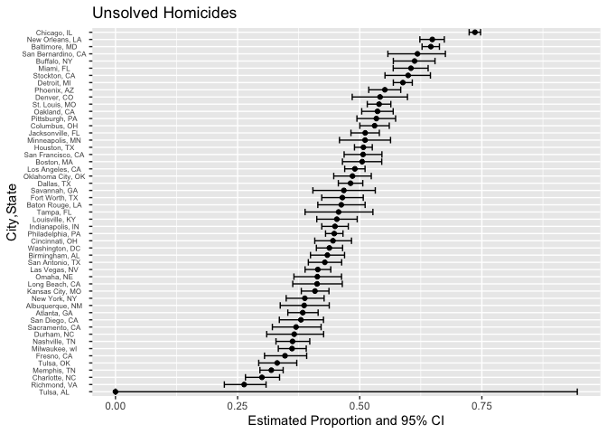

p8105_hw5_jy3269
================
Jingyi Yao
2022-11-12

# Problem 2

### 1. Describe the raw data

``` r
raw_data <- read_csv("./data/homicide-data.csv",show_col_types = FALSE)

dim(raw_data)
```

    ## [1] 52179    12

### 2. Create a `city_state` variable

``` r
homicide <- raw_data %>% 
  mutate(city_state = str_c(city,", ",state)) %>% 
  select(uid,city_state,everything()) 

homicide %>%
  head() %>% 
  knitr::kable()
```

| uid        | city_state      | reported_date | victim_last | victim_first | victim_race | victim_age | victim_sex | city        | state |      lat |       lon | disposition           |
|:-----------|:----------------|--------------:|:------------|:-------------|:------------|:-----------|:-----------|:------------|:------|---------:|----------:|:----------------------|
| Alb-000001 | Albuquerque, NM |      20100504 | GARCIA      | JUAN         | Hispanic    | 78         | Male       | Albuquerque | NM    | 35.09579 | -106.5386 | Closed without arrest |
| Alb-000002 | Albuquerque, NM |      20100216 | MONTOYA     | CAMERON      | Hispanic    | 17         | Male       | Albuquerque | NM    | 35.05681 | -106.7153 | Closed by arrest      |
| Alb-000003 | Albuquerque, NM |      20100601 | SATTERFIELD | VIVIANA      | White       | 15         | Female     | Albuquerque | NM    | 35.08609 | -106.6956 | Closed without arrest |
| Alb-000004 | Albuquerque, NM |      20100101 | MENDIOLA    | CARLOS       | Hispanic    | 32         | Male       | Albuquerque | NM    | 35.07849 | -106.5561 | Closed by arrest      |
| Alb-000005 | Albuquerque, NM |      20100102 | MULA        | VIVIAN       | White       | 72         | Female     | Albuquerque | NM    | 35.13036 | -106.5810 | Closed without arrest |
| Alb-000006 | Albuquerque, NM |      20100126 | BOOK        | GERALDINE    | White       | 91         | Female     | Albuquerque | NM    | 35.15111 | -106.5378 | Open/No arrest        |

### 3. Summarize within cities

``` r
homicide %>% 
  group_by(city_state) %>% 
  summarize(
    total_homicides = n(),
    unsolved_homicides = sum(disposition == "Open/No arrest") + sum(disposition == "Closed without arrest")) %>% 
  arrange(desc(total_homicides)) %>% 
  knitr::kable()
```

| city_state         | total_homicides | unsolved_homicides |
|:-------------------|----------------:|-------------------:|
| Chicago, IL        |            5535 |               4073 |
| Philadelphia, PA   |            3037 |               1360 |
| Houston, TX        |            2942 |               1493 |
| Baltimore, MD      |            2827 |               1825 |
| Detroit, MI        |            2519 |               1482 |
| Los Angeles, CA    |            2257 |               1106 |
| St. Louis, MO      |            1677 |                905 |
| Dallas, TX         |            1567 |                754 |
| Memphis, TN        |            1514 |                483 |
| New Orleans, LA    |            1434 |                930 |
| Las Vegas, NV      |            1381 |                572 |
| Washington, DC     |            1345 |                589 |
| Indianapolis, IN   |            1322 |                594 |
| Kansas City, MO    |            1190 |                486 |
| Jacksonville, FL   |            1168 |                597 |
| Milwaukee, wI      |            1115 |                403 |
| Columbus, OH       |            1084 |                575 |
| Atlanta, GA        |             973 |                373 |
| Oakland, CA        |             947 |                508 |
| Phoenix, AZ        |             914 |                504 |
| San Antonio, TX    |             833 |                357 |
| Birmingham, AL     |             800 |                347 |
| Nashville, TN      |             767 |                278 |
| Miami, FL          |             744 |                450 |
| Cincinnati, OH     |             694 |                309 |
| Charlotte, NC      |             687 |                206 |
| Oklahoma City, OK  |             672 |                326 |
| San Francisco, CA  |             663 |                336 |
| Pittsburgh, PA     |             631 |                337 |
| New York, NY       |             627 |                243 |
| Boston, MA         |             614 |                310 |
| Tulsa, OK          |             583 |                193 |
| Louisville, KY     |             576 |                261 |
| Fort Worth, TX     |             549 |                255 |
| Buffalo, NY        |             521 |                319 |
| Fresno, CA         |             487 |                169 |
| San Diego, CA      |             461 |                175 |
| Stockton, CA       |             444 |                266 |
| Richmond, VA       |             429 |                113 |
| Baton Rouge, LA    |             424 |                196 |
| Omaha, NE          |             409 |                169 |
| Albuquerque, NM    |             378 |                146 |
| Long Beach, CA     |             378 |                156 |
| Sacramento, CA     |             376 |                139 |
| Minneapolis, MN    |             366 |                187 |
| Denver, CO         |             312 |                169 |
| Durham, NC         |             276 |                101 |
| San Bernardino, CA |             275 |                170 |
| Savannah, GA       |             246 |                115 |
| Tampa, FL          |             208 |                 95 |
| Tulsa, AL          |               1 |                  0 |

### 4. Focus on Baltimore, MD

``` r
baltimore <- homicide %>% 
  filter(city_state == "Baltimore, MD") %>% 
  mutate(
    unsolved_homicides = ifelse(disposition == "Open/No arrest" | disposition == "Closed without arrest", 1,0)) 
```

### 5. Conduct proportion test and save the results

``` r
result_baltimore <- prop.test(sum(baltimore$unsolved_homicides),length(baltimore$unsolved_homicides)) %>% 
  broom::tidy()

result_baltimore
```

    ## # A tibble: 1 × 8
    ##   estimate statistic  p.value parameter conf.low conf.high method        alter…¹
    ##      <dbl>     <dbl>    <dbl>     <int>    <dbl>     <dbl> <chr>         <chr>  
    ## 1    0.646      239. 6.46e-54         1    0.628     0.663 1-sample pro… two.si…
    ## # … with abbreviated variable name ¹​alternative

``` r
save(result_baltimore, file = "result/results_baltimore.RData")
```

### 6. Pull the estimated proportion and confidence intervals

``` r
# using pull()
prop_estimate_baltimore <- result_baltimore %>% 
  pull(estimate)

lower_bound_baltimore <- result_baltimore %>% 
  pull(conf.low)

upper_bound_baltimore <- result_baltimore %>% 
  pull(conf.high)

baltimore_estimate <- list(
  "proportion_estimate" = prop_estimate_baltimore,
  "lower_CI_estimate" = lower_bound_baltimore,
  "upper_CI_estimate" = upper_bound_baltimore
) %>% 
  bind_rows()

baltimore_estimate
```

    ## # A tibble: 1 × 3
    ##   proportion_estimate lower_CI_estimate upper_CI_estimate
    ##                 <dbl>             <dbl>             <dbl>
    ## 1               0.646             0.628             0.663

``` r
# not using pull(), using select()
result_baltimore <- prop.test(sum(baltimore$unsolved_homicides),length(baltimore$unsolved_homicides)) %>% 
  broom::tidy() %>% 
  select(estimate,conf.low,conf.high)

result_baltimore
```

    ## # A tibble: 1 × 3
    ##   estimate conf.low conf.high
    ##      <dbl>    <dbl>     <dbl>
    ## 1    0.646    0.628     0.663

### 7. define a function

``` r
unsolved <- function(citystate){
  # filter a city
  by_city <- homicide %>% 
    filter(city_state == citystate) %>% 
    mutate(unsolved_homicides = ifelse(disposition == "Open/No arrest" | disposition == "Closed without arrest", 1,0)) 
  
  # conduct prop test for the filtered city
    result <- prop.test(sum(by_city$unsolved_homicides),length(by_city$unsolved_homicides)) %>% 
    broom::tidy() %>% 
    select(estimate, conf.low, conf.high)
    
  # output
    result
}
```

### 8. iterate the function among each city

``` r
cityname = unique(homicide$city_state) 

result <- expand_grid(city_state = cityname) %>% 
  mutate(prop_test_result = map(cityname, unsolved)) %>% 
  unnest(prop_test_result) %>% 
  arrange(desc(estimate))
```

    ## Warning in prop.test(sum(by_city$unsolved_homicides),
    ## length(by_city$unsolved_homicides)): Chi-squared approximation may be incorrect

``` r
result %>% knitr::kable(digits = 3)
```

| city_state         | estimate | conf.low | conf.high |
|:-------------------|---------:|---------:|----------:|
| Chicago, IL        |    0.736 |    0.724 |     0.747 |
| New Orleans, LA    |    0.649 |    0.623 |     0.673 |
| Baltimore, MD      |    0.646 |    0.628 |     0.663 |
| San Bernardino, CA |    0.618 |    0.558 |     0.675 |
| Buffalo, NY        |    0.612 |    0.569 |     0.654 |
| Miami, FL          |    0.605 |    0.569 |     0.640 |
| Stockton, CA       |    0.599 |    0.552 |     0.645 |
| Detroit, MI        |    0.588 |    0.569 |     0.608 |
| Phoenix, AZ        |    0.551 |    0.518 |     0.584 |
| Denver, CO         |    0.542 |    0.485 |     0.598 |
| St. Louis, MO      |    0.540 |    0.515 |     0.564 |
| Oakland, CA        |    0.536 |    0.504 |     0.569 |
| Pittsburgh, PA     |    0.534 |    0.494 |     0.573 |
| Columbus, OH       |    0.530 |    0.500 |     0.560 |
| Jacksonville, FL   |    0.511 |    0.482 |     0.540 |
| Minneapolis, MN    |    0.511 |    0.459 |     0.563 |
| Houston, TX        |    0.507 |    0.489 |     0.526 |
| San Francisco, CA  |    0.507 |    0.468 |     0.545 |
| Boston, MA         |    0.505 |    0.465 |     0.545 |
| Los Angeles, CA    |    0.490 |    0.469 |     0.511 |
| Oklahoma City, OK  |    0.485 |    0.447 |     0.524 |
| Dallas, TX         |    0.481 |    0.456 |     0.506 |
| Savannah, GA       |    0.467 |    0.404 |     0.532 |
| Fort Worth, TX     |    0.464 |    0.422 |     0.507 |
| Baton Rouge, LA    |    0.462 |    0.414 |     0.511 |
| Tampa, FL          |    0.457 |    0.388 |     0.527 |
| Louisville, KY     |    0.453 |    0.412 |     0.495 |
| Indianapolis, IN   |    0.449 |    0.422 |     0.477 |
| Philadelphia, PA   |    0.448 |    0.430 |     0.466 |
| Cincinnati, OH     |    0.445 |    0.408 |     0.483 |
| Washington, DC     |    0.438 |    0.411 |     0.465 |
| Birmingham, AL     |    0.434 |    0.399 |     0.469 |
| San Antonio, TX    |    0.429 |    0.395 |     0.463 |
| Las Vegas, NV      |    0.414 |    0.388 |     0.441 |
| Omaha, NE          |    0.413 |    0.365 |     0.463 |
| Long Beach, CA     |    0.413 |    0.363 |     0.464 |
| Kansas City, MO    |    0.408 |    0.380 |     0.437 |
| New York, NY       |    0.388 |    0.349 |     0.427 |
| Albuquerque, NM    |    0.386 |    0.337 |     0.438 |
| Atlanta, GA        |    0.383 |    0.353 |     0.415 |
| San Diego, CA      |    0.380 |    0.335 |     0.426 |
| Sacramento, CA     |    0.370 |    0.321 |     0.421 |
| Durham, NC         |    0.366 |    0.310 |     0.426 |
| Nashville, TN      |    0.362 |    0.329 |     0.398 |
| Milwaukee, wI      |    0.361 |    0.333 |     0.391 |
| Fresno, CA         |    0.347 |    0.305 |     0.391 |
| Tulsa, OK          |    0.331 |    0.293 |     0.371 |
| Memphis, TN        |    0.319 |    0.296 |     0.343 |
| Charlotte, NC      |    0.300 |    0.266 |     0.336 |
| Richmond, VA       |    0.263 |    0.223 |     0.308 |
| Tulsa, AL          |    0.000 |    0.000 |     0.945 |

### 9. plot the result

``` r
result %>%
  ggplot(aes(group = city_state, y = reorder(city_state, estimate))) + 
  geom_point(aes(x = estimate)) +
  geom_errorbar(aes(xmin = conf.low, xmax = conf.high)) +
  theme(axis.text.y = element_text(hjust = 0.5,size = 6)) +
  labs(y = "City,State", x = "Estimated Proportion and 95% CI",title = "Unsolved Homicides")
```

<!-- -->
