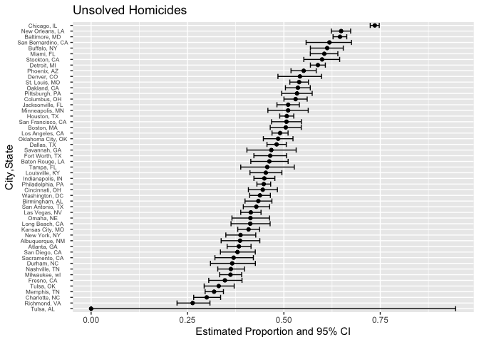
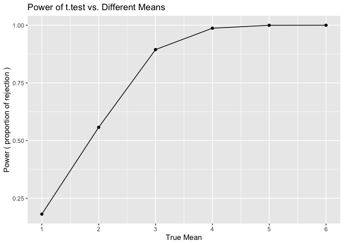
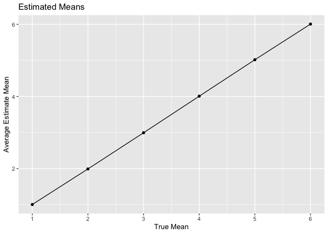
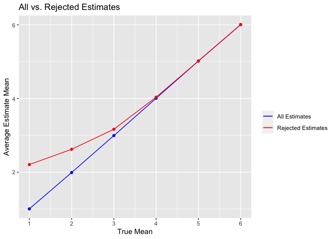

p8105_hw5_jy3269
================
Jingyi Yao
2022-11-16

# Problem 1

``` r
full_df = 
  tibble(
    files = list.files("data/zip_data/"),
    path = str_c("data/zip_data/", files)
  ) %>% 
  mutate(data = map(path, read_csv)) %>% 
  unnest()
```

``` r
tidy_df = 
  full_df %>% 
  mutate(
    files = str_replace(files, ".csv", ""),
    group = str_sub(files, 1, 3)) %>% 
  pivot_longer(
    week_1:week_8,
    names_to = "week",
    values_to = "outcome",
    names_prefix = "week_") %>% 
  mutate(week = as.numeric(week)) %>% 
  select(group, subj = files, week, outcome)
```

``` r
tidy_df %>% 
  ggplot(aes(x = week, y = outcome, group = subj, color = group)) + 
  geom_point() + 
  geom_path() + 
  facet_grid(~group)
```

<!-- -->

This plot suggests high within-subject correlation – subjects who start
above average end up above average, and those that start below average
end up below average. Subjects in the control group generally don’t
change over time, but those in the experiment group increase their
outcome in a roughly linear way.

# Problem 2

### 1. Describe the raw data

``` r
raw_data <- read_csv("./data/homicide-data.csv",show_col_types = FALSE)

dim(raw_data)
```

    ## [1] 52179    12

``` r
colnames(raw_data)
```

    ##  [1] "uid"           "reported_date" "victim_last"   "victim_first" 
    ##  [5] "victim_race"   "victim_age"    "victim_sex"    "city"         
    ##  [9] "state"         "lat"           "lon"           "disposition"

 
1.  The raw data set contains 52179 rows of observations (homicide) and
    12 columns of variables (homicide features).

2.  The variables are uid, reported_date, victim_last, victim_first,
    victim_race, victim_age, victim_sex, city, state, lat, lon,
    disposition

3.  This data set mainly documents the homicides in 50 large U.S.
    cities. Each row is a documented homicide, including the victim’s
    information, the place where the homicide took place and the result.

 
### 2. Create a `city_state` variable

``` r
homicide <- raw_data %>% 
  mutate(city_state = str_c(city,", ",state)) %>% 
  select(uid,city_state,everything())   # put the newly created variable at the front

homicide %>%
  head() %>% 
  knitr::kable()   # show the first 6 rows of the homicide dataset
```

| uid        | city_state      | reported_date | victim_last | victim_first | victim_race | victim_age | victim_sex | city        | state |      lat |       lon | disposition           |
|:-----------|:----------------|--------------:|:------------|:-------------|:------------|:-----------|:-----------|:------------|:------|---------:|----------:|:----------------------|
| Alb-000001 | Albuquerque, NM |      20100504 | GARCIA      | JUAN         | Hispanic    | 78         | Male       | Albuquerque | NM    | 35.09579 | -106.5386 | Closed without arrest |
| Alb-000002 | Albuquerque, NM |      20100216 | MONTOYA     | CAMERON      | Hispanic    | 17         | Male       | Albuquerque | NM    | 35.05681 | -106.7153 | Closed by arrest      |
| Alb-000003 | Albuquerque, NM |      20100601 | SATTERFIELD | VIVIANA      | White       | 15         | Female     | Albuquerque | NM    | 35.08609 | -106.6956 | Closed without arrest |
| Alb-000004 | Albuquerque, NM |      20100101 | MENDIOLA    | CARLOS       | Hispanic    | 32         | Male       | Albuquerque | NM    | 35.07849 | -106.5561 | Closed by arrest      |
| Alb-000005 | Albuquerque, NM |      20100102 | MULA        | VIVIAN       | White       | 72         | Female     | Albuquerque | NM    | 35.13036 | -106.5810 | Closed without arrest |
| Alb-000006 | Albuquerque, NM |      20100126 | BOOK        | GERALDINE    | White       | 91         | Female     | Albuquerque | NM    | 35.15111 | -106.5378 | Open/No arrest        |

 
### 3. Summarize within cities

``` r
homicide %>% 
  group_by(city_state) %>% 
  summarize(
    total_homicides = n(),
    unsolved_homicides = sum(disposition == "Open/No arrest") + sum(disposition == "Closed without arrest")) %>% 
  arrange(desc(total_homicides)) %>%   # arranged by total_homicides counts
  knitr::kable()
```

| city_state         | total_homicides | unsolved_homicides |
|:-------------------|----------------:|-------------------:|
| Chicago, IL        |            5535 |               4073 |
| Philadelphia, PA   |            3037 |               1360 |
| Houston, TX        |            2942 |               1493 |
| Baltimore, MD      |            2827 |               1825 |
| Detroit, MI        |            2519 |               1482 |
| Los Angeles, CA    |            2257 |               1106 |
| St. Louis, MO      |            1677 |                905 |
| Dallas, TX         |            1567 |                754 |
| Memphis, TN        |            1514 |                483 |
| New Orleans, LA    |            1434 |                930 |
| Las Vegas, NV      |            1381 |                572 |
| Washington, DC     |            1345 |                589 |
| Indianapolis, IN   |            1322 |                594 |
| Kansas City, MO    |            1190 |                486 |
| Jacksonville, FL   |            1168 |                597 |
| Milwaukee, wI      |            1115 |                403 |
| Columbus, OH       |            1084 |                575 |
| Atlanta, GA        |             973 |                373 |
| Oakland, CA        |             947 |                508 |
| Phoenix, AZ        |             914 |                504 |
| San Antonio, TX    |             833 |                357 |
| Birmingham, AL     |             800 |                347 |
| Nashville, TN      |             767 |                278 |
| Miami, FL          |             744 |                450 |
| Cincinnati, OH     |             694 |                309 |
| Charlotte, NC      |             687 |                206 |
| Oklahoma City, OK  |             672 |                326 |
| San Francisco, CA  |             663 |                336 |
| Pittsburgh, PA     |             631 |                337 |
| New York, NY       |             627 |                243 |
| Boston, MA         |             614 |                310 |
| Tulsa, OK          |             583 |                193 |
| Louisville, KY     |             576 |                261 |
| Fort Worth, TX     |             549 |                255 |
| Buffalo, NY        |             521 |                319 |
| Fresno, CA         |             487 |                169 |
| San Diego, CA      |             461 |                175 |
| Stockton, CA       |             444 |                266 |
| Richmond, VA       |             429 |                113 |
| Baton Rouge, LA    |             424 |                196 |
| Omaha, NE          |             409 |                169 |
| Albuquerque, NM    |             378 |                146 |
| Long Beach, CA     |             378 |                156 |
| Sacramento, CA     |             376 |                139 |
| Minneapolis, MN    |             366 |                187 |
| Denver, CO         |             312 |                169 |
| Durham, NC         |             276 |                101 |
| San Bernardino, CA |             275 |                170 |
| Savannah, GA       |             246 |                115 |
| Tampa, FL          |             208 |                 95 |
| Tulsa, AL          |               1 |                  0 |

 
From the table we know that :

1.  Chicago has the most total homicides (5535) and the most unsolved
    homicides(4073).

2.  Tulsa in Alabama has only 1 case of homicide and 0 unsolved
    homicide.

 
### 4. Focus on Baltimore, MD

``` r
baltimore <- homicide %>% 
  filter(city_state == "Baltimore, MD") %>% 
  mutate(
    unsolved_homicides = ifelse(disposition == "Open/No arrest" | disposition == "Closed without arrest", 1,0))  # create a binary column showing the status
```

 
### 5. Conduct proportion test and save the results

``` r
result_baltimore <- prop.test(sum(baltimore$unsolved_homicides),length(baltimore$unsolved_homicides)) %>% 
  broom::tidy()   # tidy the result

result_baltimore
```

    ## # A tibble: 1 × 8
    ##   estimate statistic  p.value parameter conf.low conf.high method        alter…¹
    ##      <dbl>     <dbl>    <dbl>     <int>    <dbl>     <dbl> <chr>         <chr>  
    ## 1    0.646      239. 6.46e-54         1    0.628     0.663 1-sample pro… two.si…
    ## # … with abbreviated variable name ¹​alternative

``` r
# the result is save in the result folder in the R project
save(result_baltimore, file = "result/results_baltimore.RData")
```

 
The `prop.test` on Baltimore estimates that 64.56% of the homicides are
unsolved, and the 95% confidence interval for the proportion estimate is
( 0.6275625, 0.6631599 )

 
### 6. Pull the estimated proportion and confidence intervals

``` r
# using pull()
prop_estimate_baltimore <- result_baltimore %>% 
  pull(estimate)

lower_bound_baltimore <- result_baltimore %>% 
  pull(conf.low)

upper_bound_baltimore <- result_baltimore %>% 
  pull(conf.high)

baltimore_estimate <- list(
  "proportion_estimate" = prop_estimate_baltimore,
  "lower_CI_estimate" = lower_bound_baltimore,
  "upper_CI_estimate" = upper_bound_baltimore
) %>% 
  bind_rows()

baltimore_estimate %>% knitr::kable()
```

| proportion_estimate | lower_CI_estimate | upper_CI_estimate |
|--------------------:|------------------:|------------------:|
|           0.6455607 |         0.6275625 |         0.6631599 |

``` r
# not using pull(), using select()
result_baltimore <- prop.test(sum(baltimore$unsolved_homicides),length(baltimore$unsolved_homicides)) %>% 
  broom::tidy() %>% 
  select(estimate,conf.low,conf.high)

result_baltimore %>% knitr::kable()
```

|  estimate |  conf.low | conf.high |
|----------:|----------:|----------:|
| 0.6455607 | 0.6275625 | 0.6631599 |

### 7. define a function

``` r
unsolved <- function(citystate){
  # filter a city
  by_city <- homicide %>% 
    filter(city_state == citystate) %>% 
    mutate(unsolved_homicides = ifelse(disposition == "Open/No arrest" | disposition == "Closed without arrest", 1,0)) 
  
  # conduct prop test for the filtered city
    result <- prop.test(sum(by_city$unsolved_homicides),length(by_city$unsolved_homicides)) %>% 
    broom::tidy() %>% 
    select(estimate, conf.low, conf.high)
    
  # output
    result 
}
```

 
We define a function called `unsolved()` to get the `prop.test` result
of the each city in the dataset.

The input of the function is the `city_state` name and the output is the
proportion point estimate and 95% confidence interval of the estimate.

 
### 8. iterate the function among each city

``` r
cityname = unique(homicide$city_state) 

result <- expand_grid(city_state = cityname) %>% 
  mutate(prop_test_result = map(cityname, unsolved)) %>% 
  unnest(prop_test_result) %>% 
  arrange(desc(estimate))
```

    ## Warning in prop.test(sum(by_city$unsolved_homicides),
    ## length(by_city$unsolved_homicides)): Chi-squared approximation may be incorrect

``` r
result %>% knitr::kable(digits = 3)
```

| city_state         | estimate | conf.low | conf.high |
|:-------------------|---------:|---------:|----------:|
| Chicago, IL        |    0.736 |    0.724 |     0.747 |
| New Orleans, LA    |    0.649 |    0.623 |     0.673 |
| Baltimore, MD      |    0.646 |    0.628 |     0.663 |
| San Bernardino, CA |    0.618 |    0.558 |     0.675 |
| Buffalo, NY        |    0.612 |    0.569 |     0.654 |
| Miami, FL          |    0.605 |    0.569 |     0.640 |
| Stockton, CA       |    0.599 |    0.552 |     0.645 |
| Detroit, MI        |    0.588 |    0.569 |     0.608 |
| Phoenix, AZ        |    0.551 |    0.518 |     0.584 |
| Denver, CO         |    0.542 |    0.485 |     0.598 |
| St. Louis, MO      |    0.540 |    0.515 |     0.564 |
| Oakland, CA        |    0.536 |    0.504 |     0.569 |
| Pittsburgh, PA     |    0.534 |    0.494 |     0.573 |
| Columbus, OH       |    0.530 |    0.500 |     0.560 |
| Jacksonville, FL   |    0.511 |    0.482 |     0.540 |
| Minneapolis, MN    |    0.511 |    0.459 |     0.563 |
| Houston, TX        |    0.507 |    0.489 |     0.526 |
| San Francisco, CA  |    0.507 |    0.468 |     0.545 |
| Boston, MA         |    0.505 |    0.465 |     0.545 |
| Los Angeles, CA    |    0.490 |    0.469 |     0.511 |
| Oklahoma City, OK  |    0.485 |    0.447 |     0.524 |
| Dallas, TX         |    0.481 |    0.456 |     0.506 |
| Savannah, GA       |    0.467 |    0.404 |     0.532 |
| Fort Worth, TX     |    0.464 |    0.422 |     0.507 |
| Baton Rouge, LA    |    0.462 |    0.414 |     0.511 |
| Tampa, FL          |    0.457 |    0.388 |     0.527 |
| Louisville, KY     |    0.453 |    0.412 |     0.495 |
| Indianapolis, IN   |    0.449 |    0.422 |     0.477 |
| Philadelphia, PA   |    0.448 |    0.430 |     0.466 |
| Cincinnati, OH     |    0.445 |    0.408 |     0.483 |
| Washington, DC     |    0.438 |    0.411 |     0.465 |
| Birmingham, AL     |    0.434 |    0.399 |     0.469 |
| San Antonio, TX    |    0.429 |    0.395 |     0.463 |
| Las Vegas, NV      |    0.414 |    0.388 |     0.441 |
| Omaha, NE          |    0.413 |    0.365 |     0.463 |
| Long Beach, CA     |    0.413 |    0.363 |     0.464 |
| Kansas City, MO    |    0.408 |    0.380 |     0.437 |
| New York, NY       |    0.388 |    0.349 |     0.427 |
| Albuquerque, NM    |    0.386 |    0.337 |     0.438 |
| Atlanta, GA        |    0.383 |    0.353 |     0.415 |
| San Diego, CA      |    0.380 |    0.335 |     0.426 |
| Sacramento, CA     |    0.370 |    0.321 |     0.421 |
| Durham, NC         |    0.366 |    0.310 |     0.426 |
| Nashville, TN      |    0.362 |    0.329 |     0.398 |
| Milwaukee, wI      |    0.361 |    0.333 |     0.391 |
| Fresno, CA         |    0.347 |    0.305 |     0.391 |
| Tulsa, OK          |    0.331 |    0.293 |     0.371 |
| Memphis, TN        |    0.319 |    0.296 |     0.343 |
| Charlotte, NC      |    0.300 |    0.266 |     0.336 |
| Richmond, VA       |    0.263 |    0.223 |     0.308 |
| Tulsa, AL          |    0.000 |    0.000 |     0.945 |

 
### 9. plot the result

``` r
result %>%
  ggplot(aes(group = city_state, y = reorder(city_state, estimate))) + 
  geom_point(aes(x = estimate)) +
  geom_errorbar(aes(xmin = conf.low, xmax = conf.high)) +
  theme(axis.text.y = element_text(hjust = 0.5,size = 6)) +
  labs(y = "City,State", x = "Estimated Proportion and 95% CI",title = "Unsolved Homicides")
```

<!-- -->

The x-axis is the estimated proportion of unsolved homicides and its 95%
CI.

The y-axis is each city_state in the dataset.

We can tell from the plot that Chicago’s unsolved homicides proportion
estimate is the the highest and it is significantly higher than the
rest.

 
 
## Problem 3

### 1. set the design element and generate 5000 samples

``` r
samples <- rerun(5000,rnorm(n = 30,mean = 0,sd = 5))
```

 
### 2. define a function to t.test 1 sample and save the estimate and p-value

``` r
t_test <- function(mu = 0) {
  sample <- tibble(rnorm(n = 30, mean = mu, sd = 5))
  
  result <- t.test(sample) %>% 
    broom::tidy() %>% 
    select(estimate,p.value)
  
  result
}
```

 
### 3. use the defined function to t.test 5000 samples with the same mean = 0

``` r
mean_0 <- expand_grid(mean = 0, iteration = 1:5000) %>% 
  mutate(result = map(mean,t_test)) %>% 
  unnest(result)

dim(mean_0)
```

    ## [1] 5000    4

``` r
head(mean_0)
```

    ## # A tibble: 6 × 4
    ##    mean iteration estimate p.value
    ##   <dbl>     <int>    <dbl>   <dbl>
    ## 1     0         1    0.520   0.549
    ## 2     0         2    1.11    0.188
    ## 3     0         3    1.01    0.220
    ## 4     0         4   -0.835   0.309
    ## 5     0         5   -0.892   0.365
    ## 6     0         6    0.557   0.503

### 4. t.test samples with different means

``` r
mean_multi <- expand_grid(mean = 1:6, iteration = 1:5000) %>% 
  mutate(result = map(mean,t_test)) %>% 
  unnest(result)

dim(mean_multi)
```

    ## [1] 30000     4

``` r
head(mean_multi)
```

    ## # A tibble: 6 × 4
    ##    mean iteration estimate  p.value
    ##   <int>     <int>    <dbl>    <dbl>
    ## 1     1         1    1.59  0.0682  
    ## 2     1         2    0.911 0.287   
    ## 3     1         3    1.75  0.0909  
    ## 4     1         4    1.96  0.0306  
    ## 5     1         5    1.84  0.0847  
    ## 6     1         6    3.35  0.000262

### 5. plot of power

``` r
mean_multi %>%
  group_by(mean) %>% 
  summarize(proportion_rejected = sum(p.value < 0.05)/5000) %>% 
  ggplot(aes(x = mean,y = proportion_rejected)) +
  scale_x_continuous(limits = c(1,6), breaks = seq(1,6,1)) + 
  geom_point() + geom_path() +
  labs(x = "True Mean",y = "Power ( proportion of rejection )",title = "Power of t.test vs. Different Means")
```

<!-- -->

 
From the plot we know that :

1.  As the true mean increases, the proportion of rejection increases.

2.  In other words, the power increases as the effect size increases,
    and ultimately approaches 1.

3.  The increasing rate (slope) of power decreases as the effect size
    increases.

 
### 6. plot of estimated means

``` r
mean_multi %>%
  group_by(mean) %>% 
  summarize(average_estimate = mean(estimate,na.rm = T)) %>% 
  ggplot(aes(x = mean,y = average_estimate)) +
  scale_x_continuous(limits = c(1,6), breaks = seq(1,6,1)) + 
  geom_point() + geom_path() +
  labs(x = "True Mean",y = "Average Estimate Mean",title = "Estimated Means")
```

<!-- -->

### 7. plot all the estimates vs. the rejected estimates

``` r
rejected_estimate <- mean_multi %>% 
  filter(p.value < 0.05) %>% group_by(mean) %>% 
  summarize(average_estimate = mean(estimate,na.rm = T)) %>% 
  ungroup()

full_estimate <- mean_multi %>% 
  group_by(mean) %>% 
  summarize(average_estimate = mean(estimate,na.rm = T)) %>% 
  ungroup()
  
ggplot(full_estimate,aes(x = mean, y = average_estimate)) +
  geom_line(data = full_estimate,aes(colour = "blue")) +
  geom_line(data = rejected_estimate,aes(colour = "red")) +
  scale_color_manual(name = " ", values = c("blue" = "blue", "red" = "red"),
                     labels = c('All Estimates','Rejected Estimates')) +
  geom_point(data = full_estimate,colour = "blue") +
  geom_point(data = rejected_estimate,colour = "red") +
  scale_x_continuous(limits = c(1,6), breaks = seq(1,6,1)) +
  labs(x = "True Mean",y = "Average Estimate Mean",title = "All vs. Rejected Estimates")
```

<!-- -->

 
From the plots above, we know :

1.  When the effect size is small(less than 4 in this case), the sample
    average of mu hat when the null is rejected is different from the
    true value of mu. It is always larger than the true value of mu.
    This is because the effect size is relatively small and the power is
    relatively low.

2.  When the effect size gets larger(larger or equal to 4 in this case),
    the sample average of mu hat when the null is rejected is
    approximately equal to the true value of mu. This is because the
    power is increasing as the effect size increases.
